Mini Data Analysis 2
================
Shreya
2023-10-21

## Overview

This report continues the exploratory data analysis performed in Report1
on the ‘cancer_dataset’ chosen from the `datateacher` package.
Incremental effort will be placed in exploring in more detail the
dataset in a fashion that will lead to generating insights to answer the
research questions.

# Setup

Begin by loading your data and the tidyverse package below:

``` r
library(datateachr) # <- might contain the data you picked!
library(tidyverse)
```

# Task 1: Process and summarize your data

From earlier analysis we know the cancer_dataset has the following high
level characteristics:

- Shape is: 569, 32

- Data class is: spec_tbl_df, tbl_df, tbl, data.frame

### 1.1 Insights

Following are the research questions formulated in Milestone 1:

1.  **Can a model classify the binary response of benign or malignant
    given the set of variables?**

2.  **Is (variable) data distribution and characteristics comparable
    between the benign and malignant classes?**

3.  **How can we find the optimized set of variables so that we have the
    highest performance? Which variable has the strongest correlation to
    the response variable**

4.  Model sensitivity is an important factor. Therefore, we need
    **identify what variables lead to highest model sensitivity?**

### 1.2 In-depth Exploratory Data Analysis

We begin the Exploratory Data Analysis by carrying out at least one
summarzing and one graphing task per research question.

#### Question 1 - Generating binary classification model

(Point 1) Let us compute summary statistics of numeric variable
‘radius_mean’ across the categorical variable ‘diagnosis’:

``` r
#The step 1 is to group the diagnosis
# Using dyplr::unite() to output range as asked in question

cancer_sample %>%
  group_by(diagnosis) %>%
  summarize(min_value=min(radius_mean), max_value=max(radius_mean), mean=mean(radius_mean,na.rm=TRUE),median=median(radius_mean), sd=sd(radius_mean)) %>%
  unite(range, min_value, max_value, sep="-")
```

    ## # A tibble: 2 × 5
    ##   diagnosis range        mean median    sd
    ##   <chr>     <chr>       <dbl>  <dbl> <dbl>
    ## 1 B         6.981-17.85  12.1   12.2  1.78
    ## 2 M         10.95-28.11  17.5   17.3  3.20

(Point 8) Graphing mean_radius with at least two geom layers:

``` r
# Using classic theme to maximize pixel-info ratio per best practices 

cancer_sample %>%
  ggplot(aes(diagnosis, radius_mean))+
  geom_boxplot(width=0.2)+
  geom_jitter(alpha=0.1, width=0.2)+
  theme_classic()
```

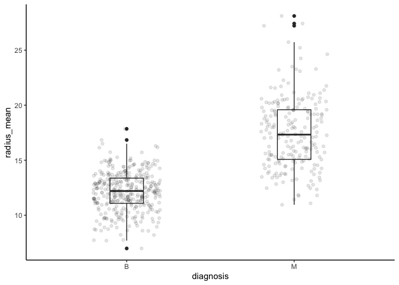<!-- -->

Conclusion : The results are pretty clear. There is in fact difference
in ‘radius_mean’ across benign and malignant diagnosis. Great indicator
that binary classification is possible!

#### Question 2 - Comparing benign and malignant data distribution

(Point 2) Computing the number of observations for categorical variable
‘diagnosis’:

``` r
# Without using table() as the output is not data frame

cancer_sample %>%
  group_by(diagnosis) %>%
  tally()
```

    ## # A tibble: 2 × 2
    ##   diagnosis     n
    ##   <chr>     <int>
    ## 1 B           357
    ## 2 M           212

Plotting graph of choice, to examine is there is class imbalance:

``` r
cancer_sample %>%
  ggplot(aes(x=factor(1), fill=diagnosis))+
  geom_bar()+
  coord_polar(theta="y")+
  scale_fill_grey()+
  theme_minimal()+
  theme(axis.title.y = element_blank())
```

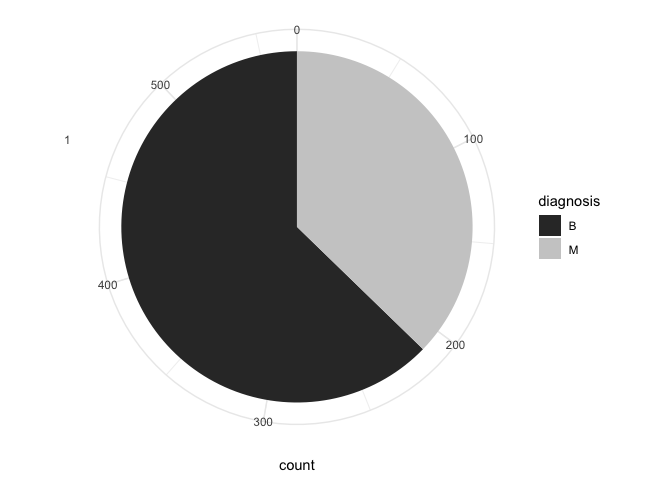<!-- -->

The above graph is deemed appropriate. (Point 6) However, an additional
graph is plotted below since the instructions require logarithmic axis
scale.

Logarithmic scale is appropriate when order of magnitude difference is
present between values, thus we select variable ‘concavity_mean’ which
has the highest order of magnitude present; ~600x.

``` r
cancer_sample %>%
  arrange(radius_mean) %>%
  ggplot(aes(x=radius_mean, y=concavity_mean))+
  geom_point(aes(color=diagnosis), alpha=0.2)+
  theme_classic()+
  scale_y_continuous("Concavity (mean)", trans="log10", labels = scales::label_scientific())+
  annotation_logticks(sides = "l")
```

    ## Warning: Transformation introduced infinite values in continuous y-axis

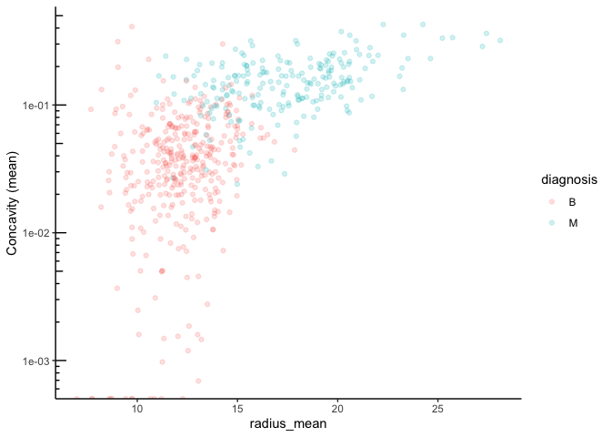<!-- -->

The above graph-being not a straight line-and having fairly distinct
regions for diagnosis class, delineates valuable insight that
radius_mean and concavity_mean do not have high co-linearity. Thus add
variance to model which can benefit from multivariate analysis.

#### Question 3 - Variable relationship w.r.t. response

(Point 3) For effective classification, We will need to compute how
other variables are correlated to the response as well. First, we will
continue with above variable ‘concavity_mean’ as an example to
demonstrate. This numeric variable has a wide range and is a good
candidate for categorization into buckets.

Getting an idea of the number of observations for categorical variable
‘concavity_mean’:

``` r
cancer_sample %>%
  group_by(concavity_mean) %>%
  tally()
```

    ## # A tibble: 537 × 2
    ##    concavity_mean     n
    ##             <dbl> <int>
    ##  1       0           13
    ##  2       0.000692     1
    ##  3       0.000974     1
    ##  4       0.00119      1
    ##  5       0.00146      1
    ##  6       0.00149      1
    ##  7       0.00155      1
    ##  8       0.00160      1
    ##  9       0.00160      1
    ## 10       0.00186      1
    ## # ℹ 527 more rows

``` r
# Adding column for categorization of 'concavity_mean' into 4 buckets

(cancer_categ <- cancer_sample %>%
  mutate(concavity_mean_level = case_when(concavity_mean<0.04 ~ "Low",
                                         concavity_mean<0.08 ~ "Normal",
                                         concavity_mean<0.12 ~ "High",
                                         TRUE ~ "Very High")))
```

    ## # A tibble: 569 × 33
    ##          ID diagnosis radius_mean texture_mean perimeter_mean area_mean
    ##       <dbl> <chr>           <dbl>        <dbl>          <dbl>     <dbl>
    ##  1   842302 M                18.0         10.4          123.      1001 
    ##  2   842517 M                20.6         17.8          133.      1326 
    ##  3 84300903 M                19.7         21.2          130       1203 
    ##  4 84348301 M                11.4         20.4           77.6      386.
    ##  5 84358402 M                20.3         14.3          135.      1297 
    ##  6   843786 M                12.4         15.7           82.6      477.
    ##  7   844359 M                18.2         20.0          120.      1040 
    ##  8 84458202 M                13.7         20.8           90.2      578.
    ##  9   844981 M                13           21.8           87.5      520.
    ## 10 84501001 M                12.5         24.0           84.0      476.
    ## # ℹ 559 more rows
    ## # ℹ 27 more variables: smoothness_mean <dbl>, compactness_mean <dbl>,
    ## #   concavity_mean <dbl>, concave_points_mean <dbl>, symmetry_mean <dbl>,
    ## #   fractal_dimension_mean <dbl>, radius_se <dbl>, texture_se <dbl>,
    ## #   perimeter_se <dbl>, area_se <dbl>, smoothness_se <dbl>,
    ## #   compactness_se <dbl>, concavity_se <dbl>, concave_points_se <dbl>,
    ## #   symmetry_se <dbl>, fractal_dimension_se <dbl>, radius_worst <dbl>, …

Re-plotting using categorized variable ‘concavity_mean_levels’:

``` r
# Using factors for visual appeal by having ascending order in bar proportion

cancer_categ %>%
  mutate(concavity_mean_level= factor(concavity_mean_level, levels = c("Low","Normal","High","Very High"))) %>%
  ggplot(aes(x = concavity_mean_level, fill=diagnosis))+
  geom_bar(position = "fill")+
  labs(y="Proportion")+
  theme_classic()
```

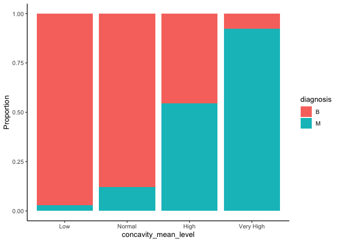<!-- -->

(Point 9) We will continue to explore the independent variable
relationship with response. Now using histograms, with different bin
sizes, for another variable ‘concave_points_mean’:

``` r
#Bin size count is 20

cancer_sample %>%
  ggplot(aes(x = concave_points_mean, color=diagnosis))+
  geom_histogram(fill="white", bins = 20)+
  theme_classic()
```

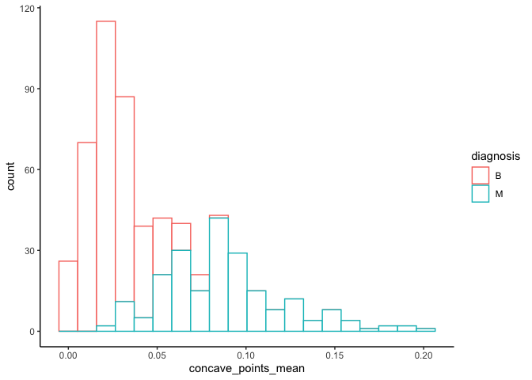<!-- -->

``` r
#Bin size count is 30

cancer_sample %>%
  ggplot(aes(x = concave_points_mean, color=diagnosis))+
  geom_histogram(fill="white", bins = 30)+
  theme_classic()
```

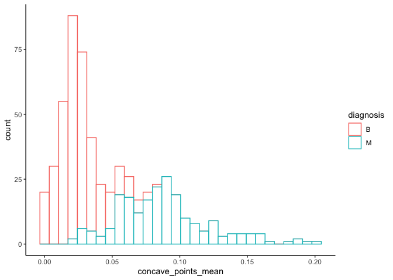<!-- -->

``` r
#Bin size count is 60

cancer_sample %>%
  ggplot(aes(x = concave_points_mean, color=diagnosis))+
  geom_histogram(fill="white", bins = 60)+
  theme_classic()
```

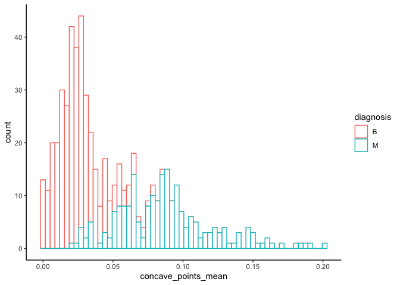<!-- -->

Thus we can see that even though there is overlap between the two
classes, there is still considerable separation that variable
‘concave_points_mean’ provides for bifurcation.

Additionally, bins=60 is the best as it is more detailed and doesn’t
overly smooth the multimodal peaks in data, which is the case with
bins=20. Bins=30 is also similar in smoothness to bins=60, however lacks
some details in the intersecting region.

#### Question4 - Relationship among closely related variables

(Point 1) We will examine the relationship across the three closely
related variables such as: ‘radius_mean’, ‘radius_se’, and
‘radius_worst’. The intention is to evaluate if there is high
collinearity which can assit in feature selection.

Unfortunately Point 4 is not applicable to the dataset, therefore, I
decided to stick with Point 1.

As in the above case with ‘radius_mean’, we first use summary statistics
to check if ‘radius_se’ and ‘radius_worst’ are relevant independent
variables:

``` r
# Analyzing variable 'radius_se'

cancer_sample %>%
  group_by(diagnosis) %>%
  summarize(min_value=min(radius_se), max_value=max(radius_se), mean=mean(radius_se,na.rm=TRUE),median=median(radius_se), sd=sd(radius_se)) %>%
  unite(range, min_value, max_value, sep="-")
```

    ## # A tibble: 2 × 5
    ##   diagnosis range          mean median    sd
    ##   <chr>     <chr>         <dbl>  <dbl> <dbl>
    ## 1 B         0.1115-0.8811 0.284  0.258 0.113
    ## 2 M         0.1938-2.873  0.609  0.547 0.345

``` r
# Analyzing variable 'radius_worst'
cancer_sample %>%
  group_by(diagnosis) %>%
  summarize(min_value=min(radius_worst), max_value=max(radius_worst), mean=mean(radius_worst,na.rm=TRUE),median=median(radius_worst), sd=sd(radius_worst)) %>%
  unite(range, min_value, max_value, sep="-")
```

    ## # A tibble: 2 × 5
    ##   diagnosis range        mean median    sd
    ##   <chr>     <chr>       <dbl>  <dbl> <dbl>
    ## 1 B         7.93-19.82   13.4   13.4  1.98
    ## 2 M         12.84-36.04  21.1   20.6  4.28

(Point 7) We observe good distinction for mean and median values across
the diagnostic classes, and thus proceed to plot the density graphs and
use alpha transparency to see the distribution intersections:

``` r
# For variable 'radius_mean'

cancer_sample %>%
  ggplot(aes(radius_mean))+
  geom_density(aes(fill=diagnosis, alpha=0.3))+
  theme_minimal()
```

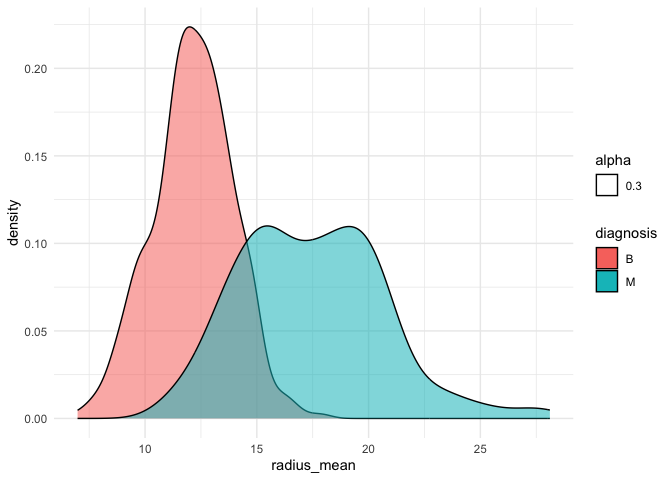<!-- -->

``` r
# For variable 'radius_se'

cancer_sample %>%
  ggplot(aes(radius_se))+
  geom_density(aes(fill=diagnosis, alpha=0.3))+
  theme_minimal()
```

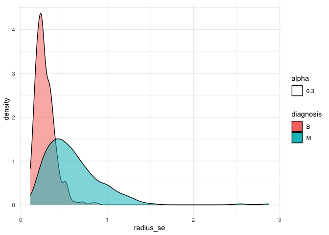<!-- -->

``` r
# For variable 'radius_worst'

cancer_sample %>%
  ggplot(aes(radius_worst))+
  geom_density(aes(fill=diagnosis, alpha=0.3))+
  theme_minimal()
```

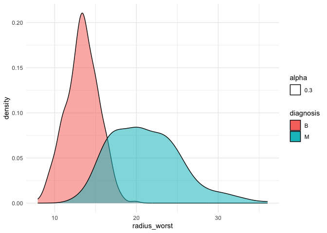<!-- -->

Since ‘radius_worst’ and ‘radius_mean’ seem to outperform ‘radius_se’,
we now proceed to check the correlation between them and drop
‘radius_se’.

``` r
cancer_sample %>%
  ggplot(aes(x=radius_mean, y=radius_worst))+
  geom_point(size=0.7, alpha=0.1)+
  geom_smooth()
```

    ## `geom_smooth()` using method = 'loess' and formula = 'y ~ x'

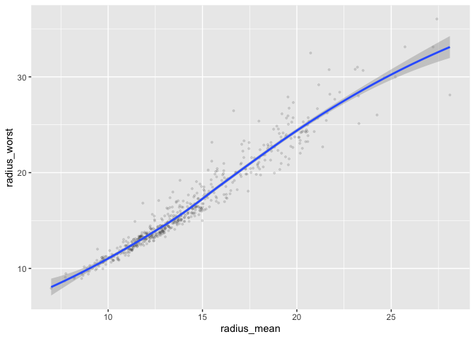<!-- -->

Visually, We can see high degree of correlation at the lower range, with
standard error increasing as the range increases. Since there is
variance, it is recommended to carry both these variables forward for
further analysis in report 3, in consideration of including in the model
features.

### 1.3 Conclusion, learning and Next Steps!

In summary, I have systematically examined:

- The dataset at a high level (noting there are no missing values).
- The various variables present and the possibility for them to act as
  features
- The relationship between various independent variables that indicate a
  good performing model is possible

I am now certain of the research question! Inclining towards Research
questions 1,**Can a binary (malignant or benign) classification model be
generated the given variables and data set?** Most interesting result
was obtained by comparing the two classification groups; which
highlighted linear relationships within the group but one that differed
in rate of change compared intra-group.

**Next steps:**

- Repeated some of the above steps for other variables and summarize
  outcomes quantitatively
- Use statistical model and set parameters using the outcomes from above
  step to answer the central research question1 (binary classification)

# Task 2: Tidy your data

This section focus on reshaping data using the `tidyr` package in order
to simplify computation.

### 2.1 Does my data set fullfill the requirements?

The entire dataset (cancer_sample) was by default present in tidy form
for my research questions. This is because:

- Each row was an observation (incl. the response variable
  malignant/benign on individual row)
- All columns represented variables
- Each cell was (a particular) value

### 2.2 Let us experiment! Untidy \<–\> Tidy

I will make my data set untidy by making the tibble longer. I collapsed
all features (such as radius_mean, area_se, etc.) into one column. In
another column I will have the (numerical) values associated to those
features. Thus, this will result in a tibble with only 4 columns, with
each row representing only one parameter of a single observation. That
is, one row, will no longer have one complete observation data; which
will be distributed over multiple rows (three to be exact).

``` r
(cancer_long <- cancer_sample %>%
   pivot_longer(cols     = c(-ID, -diagnosis), 
               names_to  = "feature",
               values_to = "numerical_value"))
```

    ## # A tibble: 17,070 × 4
    ##        ID diagnosis feature                numerical_value
    ##     <dbl> <chr>     <chr>                            <dbl>
    ##  1 842302 M         radius_mean                    18.0   
    ##  2 842302 M         texture_mean                   10.4   
    ##  3 842302 M         perimeter_mean                123.    
    ##  4 842302 M         area_mean                    1001     
    ##  5 842302 M         smoothness_mean                 0.118 
    ##  6 842302 M         compactness_mean                0.278 
    ##  7 842302 M         concavity_mean                  0.300 
    ##  8 842302 M         concave_points_mean             0.147 
    ##  9 842302 M         symmetry_mean                   0.242 
    ## 10 842302 M         fractal_dimension_mean          0.0787
    ## # ℹ 17,060 more rows

Now let us tidy the data again!

``` r
(cancer_sample <- cancer_long %>%
   pivot_wider(id_cols     = c(ID, diagnosis), 
               names_from  = "feature",
               values_from = "numerical_value"))
```

    ## # A tibble: 569 × 32
    ##          ID diagnosis radius_mean texture_mean perimeter_mean area_mean
    ##       <dbl> <chr>           <dbl>        <dbl>          <dbl>     <dbl>
    ##  1   842302 M                18.0         10.4          123.      1001 
    ##  2   842517 M                20.6         17.8          133.      1326 
    ##  3 84300903 M                19.7         21.2          130       1203 
    ##  4 84348301 M                11.4         20.4           77.6      386.
    ##  5 84358402 M                20.3         14.3          135.      1297 
    ##  6   843786 M                12.4         15.7           82.6      477.
    ##  7   844359 M                18.2         20.0          120.      1040 
    ##  8 84458202 M                13.7         20.8           90.2      578.
    ##  9   844981 M                13           21.8           87.5      520.
    ## 10 84501001 M                12.5         24.0           84.0      476.
    ## # ℹ 559 more rows
    ## # ℹ 26 more variables: smoothness_mean <dbl>, compactness_mean <dbl>,
    ## #   concavity_mean <dbl>, concave_points_mean <dbl>, symmetry_mean <dbl>,
    ## #   fractal_dimension_mean <dbl>, radius_se <dbl>, texture_se <dbl>,
    ## #   perimeter_se <dbl>, area_se <dbl>, smoothness_se <dbl>,
    ## #   compactness_se <dbl>, concavity_se <dbl>, concave_points_se <dbl>,
    ## #   symmetry_se <dbl>, fractal_dimension_se <dbl>, radius_worst <dbl>, …

### 2.3 What do we understand?

Based on the above exercise and more in-depth knowledge about my data
set now, I further select the following two questions:

1.  **Can a binary (malignant or benign) classification model be
    generated with the given variables and data set size?**

Additional thought needs to be put in terms of precision-recall, so
performance evaluation is more robust given false positive is better
than false negative in this situation.

I have selected this as the primary question because it is the
culminating exercise that can provide the most utility from analysing
this data.

2.  **What variable(s) can be used to model the response?**

I have selected this as the second question because it is a requisite
pre-cursor to the primary question. Moreover, the model performance will
be heavily dictated by the set of features selected.

The other two questions were less important to further investigate as
they will already be intrinsically included in the model selection,
training, and tuning.

**Data set:** As discussed above, I need to drop all of the ten ‘\_se’
cols:

``` r
(cancer_final <- cancer_sample %>%
  select(-radius_se, -texture_se, -perimeter_se, -area_se, -smoothness_se, -compactness_se, -concavity_se, -concave_points_se, -symmetry_se, -fractal_dimension_se) %>%
  arrange(diagnosis) %>%  # Arranging for better organization
  select(-ID) %>%   # Removing original ID column as number is non-consistent format
  mutate(ID = row_number()) %>%  # Adding consistent ID column
  select(ID, everything()))      # Moveing ID column as first col
```

    ## # A tibble: 569 × 22
    ##       ID diagnosis radius_mean texture_mean perimeter_mean area_mean
    ##    <int> <chr>           <dbl>        <dbl>          <dbl>     <dbl>
    ##  1     1 B               13.5          14.4           87.5      566.
    ##  2     2 B               13.1          15.7           85.6      520 
    ##  3     3 B                9.50         12.4           60.3      274.
    ##  4     4 B               13.0          18.4           82.6      524.
    ##  5     5 B                8.20         16.8           51.7      202.
    ##  6     6 B               12.0          14.6           78.0      449.
    ##  7     7 B               13.5          22.3           86.9      561 
    ##  8     8 B               11.8          21.6           74.7      428.
    ##  9     9 B               13.6          16.3           87.2      572.
    ## 10    10 B               11.9          18.2           75.7      438.
    ## # ℹ 559 more rows
    ## # ℹ 16 more variables: smoothness_mean <dbl>, compactness_mean <dbl>,
    ## #   concavity_mean <dbl>, concave_points_mean <dbl>, symmetry_mean <dbl>,
    ## #   fractal_dimension_mean <dbl>, radius_worst <dbl>, texture_worst <dbl>,
    ## #   perimeter_worst <dbl>, area_worst <dbl>, smoothness_worst <dbl>,
    ## #   compactness_worst <dbl>, concavity_worst <dbl>, concave_points_worst <dbl>,
    ## #   symmetry_worst <dbl>, fractal_dimension_worst <dbl>

My data set is well formed and tidy, and does not have any missing
values; hence does not require any further manipulation.

# Task 3: Modelling

Selection is as follows:

- **Research question:** Can a binary (malignant or benign)
  classification model be generated with the given variable(s)?
- **Variable of interest:** Diagnosis (malignant or benign)

## 3.1 Fitting data to a model

Binary logistic regression is used for the classification task. We will
first split the data set into training and test set so that we are able
to predict on unseen data in the next task.

``` r
# Need to convert diagnosis values for "M" and "B" to 1 and 0 respectively
# So that glm model can except numerical data required for logit regression
cancer_categ<-cancer_categ %>%
  mutate(diagnosis_numerical = case_when(diagnosis == "M" ~ 1,
                                         diagnosis == "B" ~ 0,))

# Creating test-train (20%-80%) sets by randomly splitting data
count_train <- round(0.8 * nrow(cancer_categ)) 
set.seed(100)
training_index <- sample(1:nrow(cancer_categ), count_train)
training_set <- cancer_categ[training_index, ]
test_set <- cancer_categ[-training_index, ]

# Fitting the model using training set
model <- glm(diagnosis_numerical ~ radius_mean + concave_points_mean, data = training_set, family = "binomial")

#Printing model output to screen
model
```

    ## 
    ## Call:  glm(formula = diagnosis_numerical ~ radius_mean + concave_points_mean, 
    ##     family = "binomial", data = training_set)
    ## 
    ## Coefficients:
    ##         (Intercept)          radius_mean  concave_points_mean  
    ##            -13.6028               0.6458              80.5920  
    ## 
    ## Degrees of Freedom: 454 Total (i.e. Null);  452 Residual
    ## Null Deviance:       602.4 
    ## Residual Deviance: 178.7     AIC: 184.7

## 3.2 Predicting using the fitted model

Now the above fitted model is used on test set to predict the ‘Y’
i.e.the diagnosis.

Then, the model performance is assessed through the following
statistics:

- Accuracy
- Precision
- Recall

``` r
# Predicting on the 20% test set
prediction_temp <- predict(model, test_set, type = "response") #Using type=response to output probabilities in place of logit data
prediction <- round(prediction_temp) #Rounding off value to match numerical diagnosis classification

#Renaming vector values to align with initial diagnosis naming of "M" and "B"
prediction[prediction==0] <- "B"
prediction[prediction==1] <- "M"

#Printing results in a tabular form
(confusion_matrix_table <-table("Predicted Values" = prediction, "Reference Values" = test_set$diagnosis))
```

    ##                 Reference Values
    ## Predicted Values  B  M
    ##                B 70  5
    ##                M  3 36

``` r
# Converting the above table to a tibble
(confusion_matrix <- as_tibble(confusion_matrix_table))
```

    ## # A tibble: 4 × 3
    ##   `Predicted Values` `Reference Values`     n
    ##   <chr>              <chr>              <int>
    ## 1 B                  B                     70
    ## 2 M                  B                      3
    ## 3 B                  M                      5
    ## 4 M                  M                     36

Calculating statistic values manually:

- **Accuracy:** 92%
- **Precision:** 93.3%
- **Recall:** 95.8%

These are decent results for a simple model used.

As a Responsible AI enthusiast I would definitely look into the feature
importance as next steps!

``` r
# Summarizing information about model to validate initial indicative results 
(ans3.2 <- broom::tidy(model))
```

    ## # A tibble: 3 × 5
    ##   term                estimate std.error statistic  p.value
    ##   <chr>                  <dbl>     <dbl>     <dbl>    <dbl>
    ## 1 (Intercept)          -13.6       1.77      -7.68 1.60e-14
    ## 2 radius_mean            0.646     0.123      5.24 1.60e- 7
    ## 3 concave_points_mean   80.6      10.8        7.45 9.28e-14

Using `broom` package, we can see above that both independent variables
have p-values \< 0.05, and thus positively influence the response
variable ‘diagnosis’. This validates we have correctly selected our set
of variables.

# Task 4: Reading and writing data

## 4.1 Writing data to csv file

Using the summary table (below) from Report,we save it to output folder
as a csv.

``` r
# Generating the summary table, first grouping by diagnosis
# Using dyplr::unite() to output range as asked in question

(task4.1 <- cancer_sample %>%
  group_by(diagnosis) %>%
  summarize(min_value=min(radius_mean), max_value=max(radius_mean), mean=mean(radius_mean,na.rm=TRUE),median=median(radius_mean), sd=sd(radius_mean)) %>%
  unite(range, min_value, max_value, sep="-"))
```

    ## # A tibble: 2 × 5
    ##   diagnosis range        mean median    sd
    ##   <chr>     <chr>       <dbl>  <dbl> <dbl>
    ## 1 B         6.981-17.85  12.1   12.2  1.78
    ## 2 M         10.95-28.11  17.5   17.3  3.20

``` r
# Saving as a csv
write_csv(task4.1, here::here("Output", "summary_table.csv"))

# File check
dir(here::here("output"))
```

    ## [1] "classification-model.rds" "summary_table.csv"

## 4.2 Model Reading

``` r
# Saving model object
saveRDS(model, file = here::here("Output", "classification-model.rds"))

# File check
dir(here::here("output"))
```

    ## [1] "classification-model.rds" "summary_table.csv"

``` r
# Loading the saved model
classifier <- readRDS(here::here("Output", "classification-model.rds"))

# Printing the loaded object to check                      
classifier
```

    ## 
    ## Call:  glm(formula = diagnosis_numerical ~ radius_mean + concave_points_mean, 
    ##     family = "binomial", data = training_set)
    ## 
    ## Coefficients:
    ##         (Intercept)          radius_mean  concave_points_mean  
    ##            -13.6028               0.6458              80.5920  
    ## 
    ## Degrees of Freedom: 454 Total (i.e. Null);  452 Residual
    ## Null Deviance:       602.4 
    ## Residual Deviance: 178.7     AIC: 184.7
